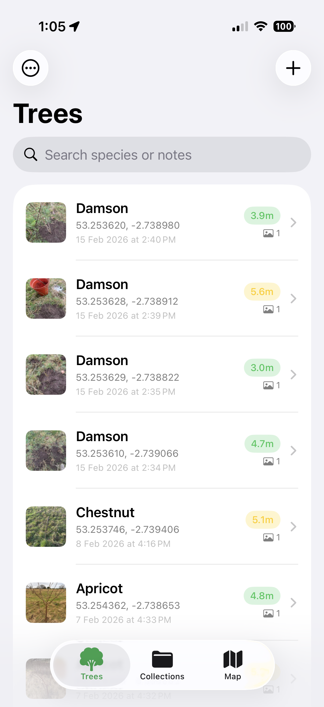
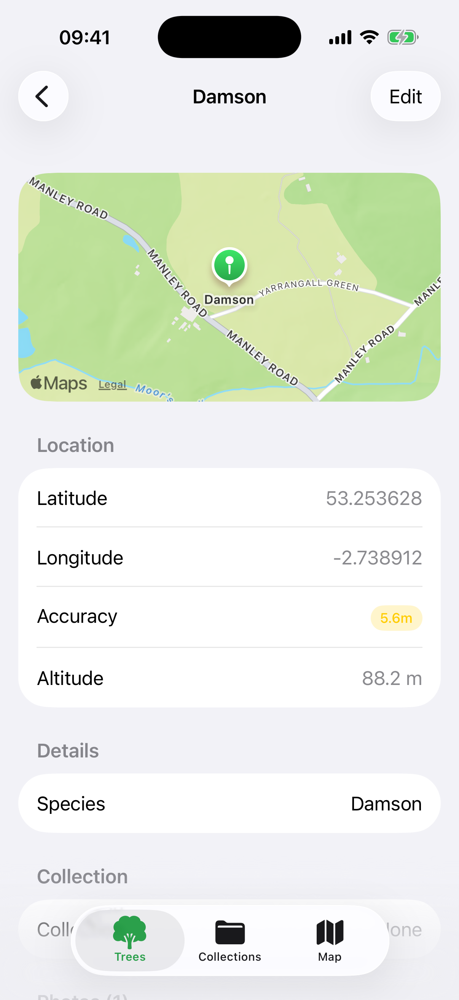
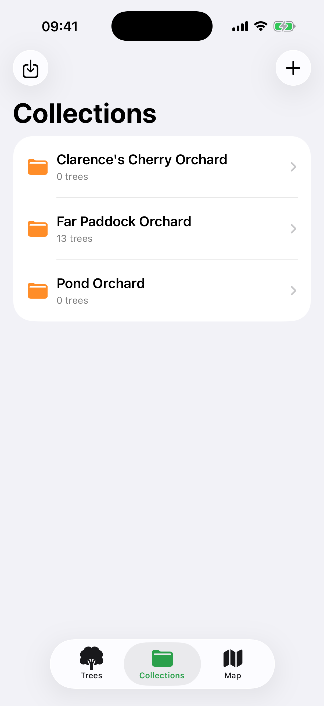
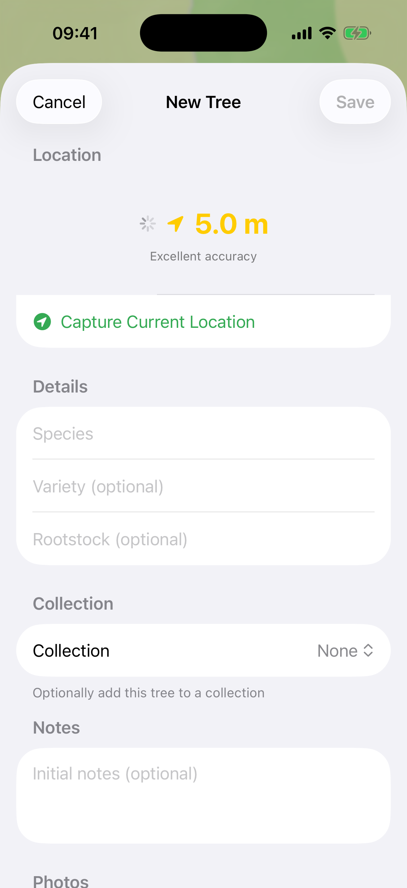

# Tree Tracker

An iOS app for capturing precise GPS locations of trees. Built for orchardists, arborists, and tree enthusiasts who need accurate location data for their trees.

## Features

- **Precise GPS Capture** - Uses maximum iOS location accuracy with real-time accuracy display. Wait for a good signal before saving.
- **Tree Details** - Record species, variety, rootstock, and notes for each tree.
- **Species Autocomplete** - Suggestions combine preset species with previously-used species from your database.
- **Photo Attachments** - Capture photos with automatic date stamps. View dates in gallery and detail views.
- **Collections** - Organize trees into named groups (e.g., "Victoria's Orchard", "Street Trees Survey").
- **Map View** - See all trees on an interactive map with toggleable species/variety labels.
- **Export** - Share data in CSV (spreadsheets), JSON (backup/interchange), or GPX (GPS apps).
- **Import** - Restore collections from JSON exports.
- **Apple Watch App** - Quick tree capture from your wrist with GPS accuracy display and species selection.
- **Watch Complication** - Add Tree Tracker to your watch face for one-tap access to capture trees.
- **Fully Offline** - All data stored locally. No account or internet required.

## Screenshots

| Tree List | Tree Detail | Map View |
|:-:|:-:|:-:|
|  |  |  |

| Collections | Capture Tree |
|:-:|:-:|
|  |  |

## Requirements

- iOS 17.0+ / watchOS 11.0+
- Xcode 16.0+
- iPhone with GPS (Apple Watch optional)

## Building

This project uses [xcodegen](https://github.com/yonaskolb/XcodeGen) to generate the Xcode project from `project.yml`.

```bash
# Install xcodegen (first time only)
brew install xcodegen

# Generate Xcode project
xcodegen generate

# Open in Xcode
open Trees.xcodeproj
```

Build and run on a physical device for accurate GPS testing. The simulator can only use simulated locations.

## Architecture

See [ARCHITECTURE.md](ARCHITECTURE.md) for detailed documentation of the app's structure, data model, and design decisions.

## Tech Stack

- **SwiftUI** - Declarative UI framework
- **SwiftData** - Persistence (iOS 17+)
- **MapKit** - Map display and annotations
- **Core Location** - GPS capture with `kCLLocationAccuracyBest`
- **PhotosUI** - Camera and photo library access
- **WatchConnectivity** - iPhone ↔ Watch data sync
- **WidgetKit** - Watch face complications

## Export Formats

### CSV
Standard comma-separated values. Opens in Excel, Numbers, Google Sheets.

```csv
id,latitude,longitude,accuracy,species,variety,rootstock,notes,created
abc-123,45.123456,-122.654321,3.5,Apple,Honeycrisp,M111,Near barn,2024-03-15T10:30:00Z
```

### JSON
Full data export with optional base64-encoded photos.

```json
[
  {
    "id": "abc-123",
    "latitude": 45.123456,
    "longitude": -122.654321,
    "horizontalAccuracy": 3.5,
    "species": "Apple",
    "variety": "Honeycrisp",
    "notes": "Near barn",
    "createdAt": "2024-03-15T10:30:00Z"
  }
]
```

### GPX
Standard GPS Exchange Format. Import into Google Earth, Gaia GPS, or other mapping tools.

```xml
<wpt lat="45.123456" lon="-122.654321">
  <name>Apple</name>
  <desc>Variety: Honeycrisp
Near barn</desc>
  <time>2024-03-15T10:30:00Z</time>
</wpt>
```

## License

MIT License - See [LICENSE](LICENSE) for details.
